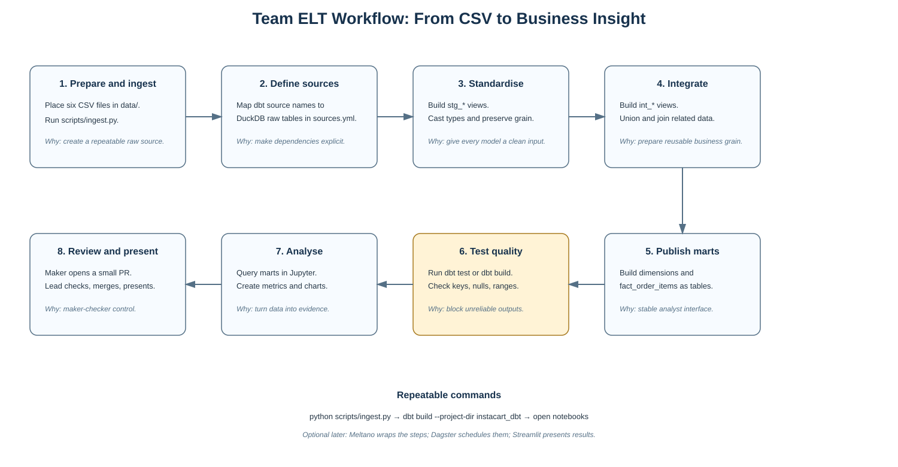
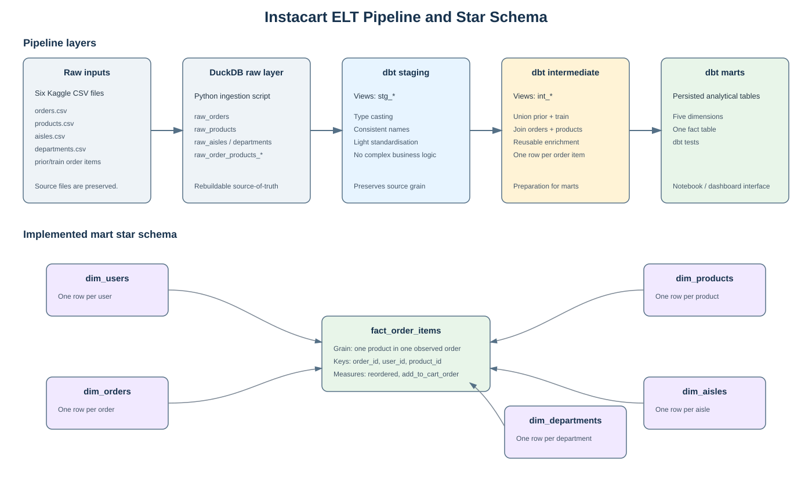

# Instacart Market Basket Analysis

NTU SCTP Module 2 group project. A small, trustworthy analytics system that turns Instacart's raw CSV files into tested, business-ready warehouse tables, a reproducible Python/dbt pipeline, and an executive-facing dashboard/deck.

## 1. Business Problem

Instacart processes millions of customer orders across thousands of products. However, the original data is distributed across six separate CSV files, making it difficult for business users to analyse ordering patterns, customer behaviour, and product demand efficiently.

**Problem we are solving.** Raw transaction files are large, split across several tables, and inconvenient for analysts to use safely. The project creates one documented route from raw data to reliable business questions: what customers buy, when they order, and which products they reorder.

**Success means.**

1. Derive meaningful insights to business users to enable them to make informed decisions.
2. Setup repeatable data pipeline for the convienience of the technology team.  
3. A new team member can clone the repository, run the pipeline, verify its quality checks, open a notebook, and trace each chart back to documented warehouse tables (Internal requirement).

## 2. Revised Project Objectives

1. Data Ingestion and Warehouse: Ingest the six Instacart CSV files into a reproducible local DuckDB warehouse using Python.
2. Data Quality and Validation: Use dbt to standardise data types and test for missing values, duplicates, invalid values, and broken relationships.
3. Star Schema Design: Build a star schema with dim_users, dim_products, dim_aisles, dim_departments, dim_orders, and fact_order_items.
4. Feature Engineering: Derive customer, order, and product features such as basket size, order frequency, reorder rate, average order gap, and product demand.
5. Python Data Analysis: Use Python and pandas to analyse ordering patterns, customer behaviour, basket composition, product demand, and reorder behaviour.
6. Dashboard and Business Recommendations: Develop a Streamlit dashboard with KPIs, charts, filters, and plain-language recommendations based on the analysis.



> **Important data boundary:** Instacart provides no calendar dates, prices, revenue, or customer demographics. This project therefore reports *behaviour* metrics — not monthly sales or monetary customer value — and documents this limitation throughout.

## 3. How This Maps to the Assignment Brief

The assignment brief recommends monthly sales trends, top-selling products, and customer segmentation by purchasing behaviour. These were adapted to what the Instacart dataset actually contains — see [`V1/docs/assignment_brief.md`](V1/docs/assignment_brief.md) for the original brief and [`V1/docs/README.md`](V1/docs/README.md) §3 for the full mapping table.

| Dashboard page | Business question |
|---|---|
| 1. Overview / Order Activity | When do customers place orders, and what is the typical order size? |
| 2. Customer Segments | What customer purchasing segments exist, and how do their behaviours differ? |
| 3. Product Analysis | Which products/departments/aisles have the highest demand and reorder rate? |

## 4. Architecture

Local-source data is ingested via **Meltano**, loaded into **DuckDB**, transformed and tested with **dbt**, orchestrated with **Dagster** (future development/ optional), and analysed via **Jupyter** / visualised in **Streamlit / Power BI**.



Full field-level definitions: [`notebook/data_dictionary`](notebook/data_dictionary.md)

## 6. Data Cleaning and Feature Engineering

Full write-up of profiling, missing-value handling, duplicate/uniqueness checks, referential-integrity checks, and outlier handling: [`notebook/data_dictionary`](notebook/data_dictionary.md)

Key engineered features: `basket_size`, `customer_reorder_rate`, `average_order_gap`, `customer_segment`, `time_band`, `product_reorder_rate`. Full definitions and calculations: [`notebook/data_dictionary`](notebook/data_dictionary.md)

## 7. Team and Task Assignment

| Owner(s) | Responsibility |
|---|---|
| Lai Yoke, Jenny Hwo | Data warehouse design (star schema), local DuckDB pipeline + validation, GitHub repo |
| Benedict, Jowber |  Data Validation, Feature Engineering, EDA, dashboard, EDA portion presentation, audience Q&A|
| Wei Xiang | Integration review, ELT portion presentation, audience Q&A |

## 8. Repository Structure

```text
instacart-analytics/
├── README.md                # this file
├── docs/                    # architecture decisions, data dictionary, diagrams, assignment brief
├── data/                    # dataset location / download instructions (raw CSVs not committed)
├── scripts/                 # Python ingestion and quality-check scripts
├── dbt_project/             # staging, intermediate, mart SQL models and tests
├── notebooks/               # numbered, reproducible analysis notebooks (including data_dictionary.md)
├── tests/                   # Python tests where dbt tests are not sufficient
├── V1/                      # previous version repo
└── assets/                  # contains image
```

Generated databases, raw CSVs, notebook caches, and secrets must not be committed. Code, model SQL, test definitions, documentation, and a reproducible dependency file must be committed.

## 9. Steps to troubeshoot from scratch (delete instacart_dbt, only keep csv in data folder & *.yml)

1. run `conda create -n elt python=3.11 -y`
2. run `conda activate elt`
3. run `python -m pip install -r requirements.txt` (make sure you install within virtual env)
4. go to data/.gitkeep and download csv via the link provided
5. run `python scripts/ingest.py`
6. run `python scripts/check_database.py`
7. run `dbt --version` then `dbt init instacart_dbt` (make sure you installed duckdb plugin & configure profiles.yml)
8. from the options `choose duckdb`
9. run `dbt debug --project-dir instacart_dbt` (test connection)
10. run `dbt run --project-dir instacart_dbt` (create models)
11. run `rm -rf instacart_dbt/models/example` (remove example, unnecessary for project)
12. run `dbt test --project-dir instacart_dbt` (at this stage, the correct response is "Nothing to do")
13. run `mkdir -p instacart_dbt/models/staging` (create stage model)
14. make sure instacart_dbt/model/sources.yml is transferred correctly
15. run `dbt test --project-dir instacart_dbt`

## 10. At-a-glance glossary

.sql files       → transformation logic
.yml files       → metadata, relationships, configuration, and tests
DuckDB           → executes the compiled SQL
dbt              → coordinates everything

**Star Schema details refer to [`notebook/data_dictionary`](notebook/data_dictionary.md)**

## 11. quick setup

1. After cloning the repository, create and activate the Conda `elt` environment
2. install requirements.txt; `python -m pip install -r requirements.txt`
3. place the six source CSV files in [data/ folder](/data/)
4. configure the local DuckDB path in `cat ~/.dbt/profiles.yml` (make sure it points to local porject db `~/module-2-project-instacart-analytics/warehouse/instacart.duckdb`)
5. Then run `meltano run ingest:run dbt_build:run` to rebuild the raw warehouse, execute all dbt transformations, and run the data-quality tests.