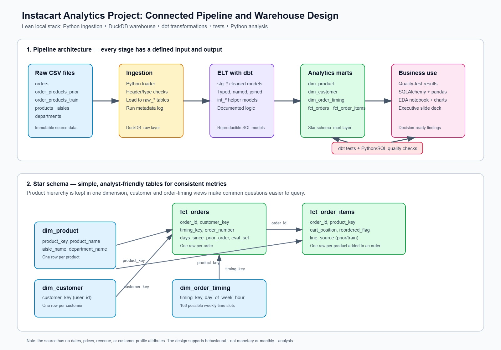

# Instacart Market Basket Analysis

NTU SCTP Module 2 group project. A small, trustworthy analytics system that turns Instacart's raw CSV files into tested, business-ready warehouse tables, a reproducible Python/dbt pipeline, and an executive-facing dashboard/deck.

## 1. Business Problem

Instacart processes millions of customer orders across thousands of products. However, the original data is distributed across six separate CSV files, making it difficult for business users to analyse ordering patterns, customer behaviour, and product demand efficiently.

**Problem we are solving.** Raw transaction files are large, split across several tables, and inconvenient for analysts to use safely. The project creates one documented route from raw data to reliable business questions: what customers buy, when they order, and which products they reorder.

**Success means.** A new team member can clone the repository, run the pipeline, verify its quality checks, open a notebook, and trace each chart back to documented warehouse tables.

## 2. Project Objectives

1. Ingest the six Instacart source files into BigQuery to provide centralised and scalable data storage.
2. Clean and validate the raw data by checking missing values, duplicate records, data types, and logical inconsistencies.
3. Transform the source data into a star-schema-based analytical model containing customer, product, order-time, order, and order-item tables.
4. Engineer customer, order, and product features such as basket size, customer order frequency, reorder rate, average order gap, and customer segment.
5. Use Python and pandas to analyse ordering patterns, customer purchasing behaviour, and product demand.
6. Develop a Streamlit dashboard that communicates the findings through KPI cards, charts, filters, and business implications.

> **Important data boundary:** Instacart provides no calendar dates, prices, revenue, or customer demographics. This project therefore reports *behaviour* metrics — not monthly sales or monetary customer value — and documents this limitation throughout.

## 3. How This Maps to the Assignment Brief

The assignment brief recommends monthly sales trends, top-selling products, and customer segmentation by purchasing behaviour. These were adapted to what the Instacart dataset actually contains — see [`docs/assignment_brief.md`](docs/assignment_brief.md) for the original brief and [`docs/README.md`](docs/README.md) §3 for the full mapping table.

| Dashboard page | Business question |
|---|---|
| 1. Overview / Order Activity | When do customers place orders, and what is the typical order size? |
| 2. Customer Segments | What customer purchasing segments exist, and how do their behaviours differ? |
| 3. Product Analysis | Which products/departments/aisles have the highest demand and reorder rate? |

## 4. Architecture

Local-source data is ingested via **Meltano**, loaded into **BigQuery**, transformed and tested with **dbt**, orchestrated with **Dagster**, and analysed via **Jupyter** / visualised in **Streamlit / Power BI**.



## 6. Data Cleaning and Feature Engineering

Key engineered features: `basket_size`, `customer_reorder_rate`, `average_order_gap`, `customer_segment`, `slot_key`, `time_band`, `product_reorder_rate`. Full definitions and calculations: [`docs/DATA_DICTIONARY.md`](docs/DATA_DICTIONARY.md) §4.

## 7. Team and Task Assignment


> **Pending confirmation (as of 2026-08-20):** Wei Xiang flagged that the split below may not match what was agreed. His understanding: Lai Yoke + Jenny Hwo also own producing the cleaned `.db` file (not just schema design); Benedict + Jowber validates the cleaned data against the documentation and runs EDA; the Streamlit dashboard can be built by either Benedict + Jowber or Wei Xiang. To be confirmed with the full team after class and this table updated accordingly.

| Owner(s) | Responsibility |
|---|---|
| Lai Yoke, Jenny Hwo | Data warehouse design (star schema), local DuckDB pipeline + validation, GitHub repo |
| Benedict, Jowber | ELT / data cleaning (in GCP, BigQuery), dbt, EDA, dashboard |
| Wei Xiang | Integration review, presentation, audience Q&A |

## 8. Repository Structure

```text
instacart-analytics/
├── README.md                # this file
├── data/                    # dataset location / download instructions (raw CSVs not committed, only .gitkeep)
├── scripts/                     # Python ingestion and quality-check scripts
├── warehouse/               # generated warehouse artefacts (ignored)
├── dbt_project/             # staging, intermediate, mart SQL models and tests
├── notebooks/               # numbered, reproducible analysis notebooks (including data_dictionary.md)
├── V1/                      # previous version of this repo
├── assets/                  # contains images
```

Generated databases, raw CSVs, notebook caches, and secrets must not be committed. Code, model SQL, test definitions, documentation, and a reproducible dependency file must be committed.

## 9. Status / Open Items

- [ ] Reconcile `dim_user` engineered-feature fields, `slot_key` type, `time_band`/`day_part` naming, `reordered` type, and `fact_order_item.item_count` between the ERD and `docs/DATA_DICTIONARY.md` (tracked in that file §6).
- [ ] Confirm dataset placement/download instructions in `data/README.md`.
- [ ] Repo scaffold created 2026-08-19; dbt models, ingestion scripts, and notebooks to follow.
